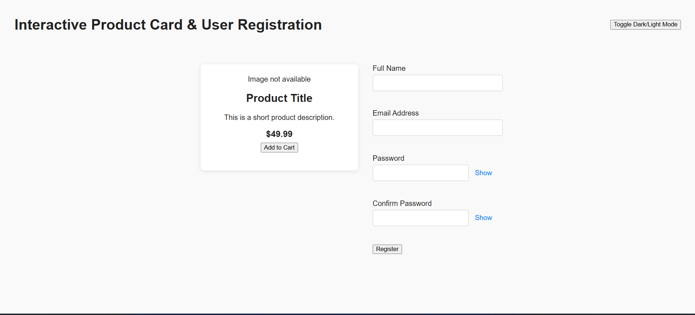

# Interactive Product Card and User Form with Validation and UI

## Description

A responsive web page featuring a product card and a user registration form. The project demonstrates form validation, error handling, password visibility toggle, and dark/light mode using only HTML, CSS, and JavaScript (no frameworks).

## Features

-   Product card with image, title, description, price, and Add to Cart button
-   Success message on Add to Cart
-   Fallback for missing product image
-   User registration form with validation (Full Name, Email, Password, Confirm Password)
-   Error messages and input highlighting
-   Password show/hide toggle
-   Prevents form submission on validation errors
-   Success message on registration
-   Dark mode and light mode toggle (theme persists)
-   Responsive design

## Instructions to Run

1.  Clone or download the repository.
2.  Open `index.html` in your browser.
3.  Test product card and registration form features.
4.  Toggle dark/light mode using the button.

## Screenshots

Add screenshots to the `screenshots/` folder to showcase your project features. You can take screenshots using your operating system's screenshot tool and save them as PNG files in the folder.

### Example Screenshot

### Product Card

### Form Validation Errors

### Dark Mode and Light Mode

---

**How to add screenshots:**

1.  Open your project in the browser and navigate to the feature you want to capture.
2.  Use your computer's screenshot tool (e.g., Snipping Tool, Print Screen, or Screenshot app) to take a screenshot.
3.  Save the screenshot as a PNG file in the `screenshots/` folder.
4.  Rename the file to match the references above (e.g., `product-card.png`, `form-validation.png`, `dark-mode.png`, `light-mode.png`).
5.  Your screenshots will automatically appear in the README when viewed on GitHub.